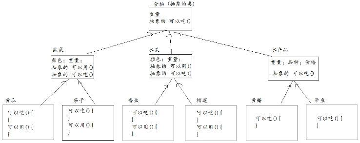

# 知识点

封装，继承，抽象类

## 题目1（加强训练）

按步骤编写代码，控制台打印效果如下:


### 训练目标

1、掌握封装的使用

2、掌握继承的特点

3、理解继承的好处

### 训练提示

1、分析出谁是父类谁是子类，以及哪些是父类需要定义的，哪些是子类独有的

2、使用封装定义类的成员属性

3、子类可以继承父类私有的内容，但是不能直接访问

4、子类可以通过super调用父类的构造方法，来初始化子类对象

### 参考方案

使用封装特性定义类的属性

使用继承避免代码冗余

### 操作步骤

1、定义员工Employee类,该类具有如下成员:

​	(1) 属性：姓名(name,字符串类型)，工号(workId,字符串类型)，部门(dept,字符串类型),属性私有

​	(2) 方法:

​			① 空参数构造和满参数构造

​			② 提供属性的set/get方法

​			③ 定义showMsg方法，方法没有形参，方法的返回值类型是void,方法内打印depart和name和id

2、定义经理Manager类继承Employee类，该类具有如下成员:

​	(1) 属性:职员Clerk(该经理的职员)

​	(2) 方法:

​			① 空参数构造方法和满参数构造方法

​			② 属性的get和set方法

​			③ 重写父类的showMsg方法，方法内先调用父类的showMsg方法，然后打印经理中的职员的名字

3、定义职员Clerk类继承Employee类，该类具有如下成员:

​	(1) 属性:经理Manager(该职员的经理)

​	(2) 方法:

​			① 空参数构造方法和满参数构造方法

​			② 属性的get和set方法

​			③ 重写showMsg方法，方法内先调用父类的showMsg方法，然后打印经理的名字

4、创建Test测试类，测试类中创建main方法，main方法中创建经理对象和职员对象，信息分别如下:  

 

 

设置经理的职员为李小亮，设置职员的经理为张小强

分别调用经理的showMsg方法和职员的showMsg方法

### 参考答案

**Employee.java**

~~~java
public class Employee {
    // a)成员变量: 工号(id),姓名(name), 部门(dapart)
    private String id;
    private String name;
    private String depart;

    public Employee() {
        super();
    }

    public Employee(String id, String name, String depart) {
        this.id = id;
        this.name = name;
        this.depart = depart;
    }

    public String getId() {
        return id;
    }
    public void setId(String id) {
        this.id = id;
    }
    public String getName() {
        return name;
    }
    public void setName(String name) {
        this.name = name;
    }

    public void showMsg() {
        System.out.print(depart+"的:"+ name);
        System.out.println(",员工编号:"+id);
    }
}


~~~

**Manager.java**

```java
public class Manager extends Employee{
    Clerk c ;
    public Manager() {
    }

    public Manager(String id, String name, String depart) {
        super(id, name, depart);
    }

    public Clerk getC() {
        return c;
    }

    public void setC(Clerk c) {
        this.c = c;
    }

    @Override
    public void showMsg() {
        super.showMsg();
        System.out.println("他的职员是"+ c.getName());
    }
}

```


**Clerk.java**

```java
public class Clerk extends Employee{
    Manager m;
    public Clerk() {

    }

    public Clerk(String id, String name, String depart) {
        super(id, name, depart);
    }

    public Manager getM() {
        return m;
    }

    public void setM(Manager m) {
        this.m = m;
    }
    @Override
    public void showMsg() {
        super.showMsg();
        System.out.println("他的经理是"+ m.getName());
    }
}
```

**Test.java**

```java
public class Test {
    public static void main(String[] args) {
        // 创建 经理对象
        Manager manager = new Manager("M001" , "张小强" , "销售部");
        // 创建 职员对象
        Clerk clerk = new Clerk("C001" , "李小亮" , "销售部");
        // 设置职员信息
        manager.setC(clerk);
        // 设置经理信息
        clerk.setM(manager);
        // 展示信息
        manager.showMsg();
        clerk.showMsg();

    }
}
```


### 视频讲解

另附avi格式视频。


## 题目2（综合案例）

编写程序,实现游戏中的英雄系统；

要求：

1.提供至少两个英雄；

2.英雄的属性：名称；HP；MP；攻击力；防御；

3.英雄的功能：三个攻击技能，一个说台词的功能；

4.每种技能需要消耗固定MP，MP不足则无法释放技能；

5.技能也是一种事物，具有名称、消耗的mp以及对基本攻击加成的属性；

### 训练目标

1、掌握封装的使用

2、掌握继承的特点

3、理解继承的好处

4、掌握抽象类的特点

4、理解抽象类的好处

### 训练提示

1、不同的英雄有公有的属性和行为，可以创建英雄的父类，在父类中定义这些内容

2、所有英雄都能释放三个技能，并具有说话的行为，而且各英雄的技能和所说的话均不同，因此英雄的父类要定义为抽象类

3、释放技能时，需要判断当前英雄对象的mp是否大于等于所释放技能要求的mp值

4、三个技能的释放有共同的特点，需要抽离出来，避免代码冗余

### 参考方案

使用封装特性定义类的属性

继承抽象类避免代码冗余

### 操作步骤

1、创建英雄类的父类，父类为抽象类

​		定义英雄类的成员属性和成员方法，要求属性要私有，对外提供公有的getter和setter方法

​		提供空参构造和满参构造

2、定义两个子类英雄，并重写父类的释放技能的方法和说台词的功能

3、抽取释放技能的公有内容，放到父类中

4、创建技能类

​		提供私有的成员属性

​		提供getter和setter方法

### 参考答案

```java
abstract class Hero{//抽象的英雄
	private String name;//名称
	private int hp;//血量
	private int mp;//魔法值
	private int attack;//攻击力
	private int defenses;//防御力
	public String getName() {
		return name;
	}
	public void setName(String name) {
		this.name = name;
	}
	public int getHp() {
		return hp;
	}
	public void setHp(int hp) {
		this.hp = hp;
	}
	public int getMp() {
		return mp;
	}
	public void setMp(int mp) {
		this.mp = mp;
	}
	public int getAttack() {
		return attack;
	}
	public void setAttack(int attack) {
		this.attack = attack;
	}
	public int getDefenses() {
		return defenses;
	}
	public void setDefenses(int defenses) {
		this.defenses = defenses;
	}
	public Hero(String name, int hp, int mp, int attack, int defenses) {
		this.name = name;
		this.hp = hp;
		this.mp = mp;
		this.attack = attack;
		this.defenses = defenses;
	}
	//说台词的行为
	public abstract void say();
	//发动技能具有共同的操作，抽取公共操作到方法中
	public void startAnility(Ability ability){
		//判断MP是否足够；如果不足，则技能发动失败；否则，成功发动技能攻击到目标，并减去相应MP
		int consume = ability.getMpConsume();
		if(this.mp < consume){
			System.out.println("魔法不足，技能不能发动！");
		}else{
			this.mp -= consume;
			//计算伤害，等于攻击力乘以技能加成的倍数
			double sh = ability.getMultiple()*this.attack;
			System.out.println(this.name+"发动技能"+ability.getName()+"，耗费"+consume+"点魔法，对敌人造成"+sh+"点攻击！");
		}
	}
	//发动一技能
	public abstract void startFirstAbility();
	//发动二技能
	public abstract void startSecondAbility();
	//发动三技能
	public abstract void startThirdAbility();
}
class Ability{//表示技能
	private String name;//技能名字
	private double multiple;//技能对攻击增加的伤害倍数
	private int mpConsume;//技能消耗的mp
	public String getName() {
		return name;
	}
	public void setName(String name) {
		this.name = name;
	}
	public double getMultiple() {
		return multiple;
	}
	public void setMultiple(double multiple) {
		this.multiple = multiple;
	}
	public int getMpConsume() {
		return mpConsume;
	}
	public void setMpConsume(int mpConsume) {
		this.mpConsume = mpConsume;
	}
	public Ability(String name, double multiple, int mpConsume) {
		this.name = name;
		this.multiple = multiple;
		this.mpConsume = mpConsume;
	}
}
class HouYi extends Hero{//表示后羿
	public HouYi() {
		super("后羿", 3500, 2600, 160,210);
	}
	public void say() {
		System.out.println(this.getName() + "说：周日，被我射熄火了，所以今天是周一！");
	}
	//表示后羿发动一技能
	public void startFirstAbility() {
		startAnility(new Ability("炙热之风",1.5,10));
	}
	//表示后羿发动二技能
	public void startSecondAbility() {
		startAnility(new Ability("燎原箭雨",2,20));
	}
	//表示后羿发动三技能
	public void startThirdAbility() {
		startAnility(new Ability("惩戒射击",3,30));
	}
}
class LuBan extends Hero{//表示鲁班七号
	public LuBan() {
		super("鲁班七号", 3000, 2000, 150,200);
	}
	public void say() {
		System.out.println(this.getName() + "说：借你们肉体实验新发明的威力！");
	}
	//表示鲁班发动一技能
	public void startFirstAbility() {
		startAnility(new Ability("河豚手雷",1.5,10));
	}
	//表示鲁班发动二技能
	public void startSecondAbility() {
		startAnility(new Ability("无敌鲨鱼炮",2.5,25));
	}
	//表示鲁班发动三技能
	public void startThirdAbility() {
		startAnility(new Ability("空中支援",3,40));
	}
}
```

### 视频讲解

另附avi文件提供。

## 题目3（综合扩展）

创建类描述黄瓜、茄子、香蕉、榴莲、黄鳝、带鱼；它们各自拥有的属性和功能如下：（后面带小括号的是功能）

黄瓜：颜色；重量；可以吃(){黄瓜炒蛋}；可以使用(){做面膜}

茄子：颜色；重量；可以吃(){油焖茄子}；可以使用(){做中药}

香蕉：颜色；重量；可以吃(){脆皮香蕉}；可以使用(){做香蕉面膜}

榴莲：颜色；重量；可以吃(){榴莲酥}；可以使用(){砸人}

黄鳝：重量；品种；价格；可以吃(){鳝鱼粥};

带鱼：重量；品种；价格；可以吃(){糖醋带鱼};

思考它们的继承关系；

### 训练目标

分析需求，从需求中抽取出类的关系图

### 训练提示

1、看到公有属性和行为，就要想到继承

2、实现继承时要考虑有没有必要定义抽象类

3、继承的关键在于分析某几个对象是不是有“血缘关系”

### 参考方案

黄瓜和茄子都是蔬菜，所以黄瓜和茄子应该继承蔬菜；

香蕉和榴莲都是水果，所以香蕉和榴莲应该继承水果；

黄鳝和带鱼都是水产品，所以黄鳝和榴莲应该继承水产品；

蔬菜、水果和水产品都属于食物，都可以吃，所以他们都应该继承食物；

关系画图如下：

 


### 视频讲解

另附avi文件提供。

