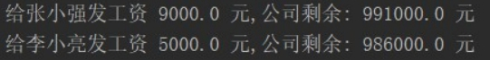

# 知识点

接口、抽象类、继承

## 题目1（综合案例）

模拟公司给员工发工资，代码实现，效果如图所示：

 

### 训练目标

1、理解继承的思想

2、掌握接口的使用

### 训练提示

1、程序员和经理都属于员工，使用继承

2、员工作为父类，为其提供带参的构造函数，子类的有参构造需调用父类的有参构造

3、公司类中定义总资金属性，通过总资金扣除员工的工资，得出发工资后工资剩余的总资金


### 参考方案

使用继承抽取程序员和经理的公有内容

在接口中定义支付工资的方法

### 操作步骤

1. 定义Employee类,包含属性：姓名，薪资

2. 定义经理Manager类继承Employee类 

3. 定义程序员Coder类继承Employee类 

4. 定义Money接口包含抽象的paySalary方法,参数为(Employee emp)

5. 定义Company类,实现Money接口,Company类包含公司总资金属性

6. 在Company类中重写paySalary方法.当给一个员工发工资的时候.公司总资金减去已发工资

7. 在main方法中创建Manager对象m 

8. 在main方法中创建Coder对象c 

9. 在main方法中创建Company对象

10. 在main方法中调用Company的paySalary方法,传入m和c对象

### 参考答案

```java
//1. 定义员工Employee类。包含属性：姓名，薪资
public class Employee {
    private String id;
    private String name;
    private double salary;

    public Employee() {
    }

    public Employee(String id, String name, double salary) {
        this.id = id;
        this.name = name;
        this.salary = salary;
    }

    public String getId() {
        return id;
    }

    public void setId(String id) {
        this.id = id;
    }

    public String getName() {
        return name;
    }

    public void setName(String name) {
        this.name = name;
    }

    public double getSalary() {
        return salary;
    }

    public void setSalary(double salary) {
        this.salary = salary;
    }
}
//2. 定义经理Manager类继承Employee类
class  Manager extends  Employee{
    public Manager(String id, String name, double salary) {
        super(id, name, salary);
    }
}

//3. 定义程序员Coder类继承Employee类
class Coder extends  Employee{
    public Coder(String id, String name, double salary) {
        super(id, name, salary);
    }
}

//4. 定义Money接口包含抽象的paySalary方法,参数为(Employee emp)
interface Money{
    public abstract void paySalary(Employee emp);
}

//5. 定义Company类,实现Money接口,Company类包含公司总资金属性
class Company implements Money{

    private double totalMoney;

    //6. 在Company类中重写paySalary方法.当给一个员工发工资的时候.公司总资金减去已发工资
    @Override
    public void paySalary(Employee emp) {
    totalMoney -= emp.getSalary();
        System.out.println("给"+emp.getName()+"发工资"+emp.getSalary()+",公司还剩余:"+totalMoney+"元");
    }

    public Company() {
    }
    public Company(double totalMoney) {
        this.totalMoney = totalMoney;
    }

    public double getTotalMoney() {
        return totalMoney;
    }

    public void setTotalMoney(double totalMoney) {
        this.totalMoney = totalMoney;
    }
}

public class Test {
    public static void main(String[] args) {
        //7. 在main方法中创建Manager对象m
        Manager m = new Manager("M001","张小强",9000);
        //8. 在main方法中创建Coder对象c
        Coder c = new Coder("C001","李晓亮",5000);
        //9. 在main方法中创建Company对象
        Company company = new Company(1000000);
        //10. 在main方法中调用Company的paySalary方法,传入m和c对象
        company.paySalary(m);
        company.paySalary(c);
    }
}
```

### 视频讲解

另附avi文件提供。

## 题目2（综合扩展）

模拟各种商品添加到购物车，电子商品打8.8折优惠，展示所有商品信息。

代码实现，效果如图所示：

 

### 训练目标

1、掌握继承的使用

2、了解ArrayList的使用

3、掌握集合的遍历

4、能从需求中分析出类的关系

### 训练提示

1.定义购物车类。

2.使用ArrayList作为成员变量，保存各种商品对象。

3.提供添加商品，移除商品，计算总价的方法。

4.定义商品类Goods，包含商品名称，id，价格等属性。

5.定义电子商品类EGoods继承Goods。

6.定义笔记本类Laptop继承电子商品EGoods类。

7.定义手机类继承继承电子商品EGoods类类。

8.定义水果类Fruit继承商品类。

### 操作步骤


1. 定义Goods商品类,包含商品编号id,商品名称name,商品价格price属性

2. 定义EGoods继承Goods类 

3. 定义Phone继承EGoods类 

4. 定义Laptop继承EGoods类 

5. 定义Fruit继承Goods类 

6. 定义购物车类GouWuChe

7. 在购物车类GouWuChe中定义ArrayList成员变量,用于保存购物车中的商品

8. 在购物车类GouWuChe中定义addGoods方法,参数为(Goods goods)。addGoods方法功能是将商品保存到ArrayList集合中

9. 在购物车类GouWuChe中定义showGoods方法.showGoods方法功能是遍历ArrayList集合中的所有商品信息并打印

10. 在购物车类GouWuChe中定义total方法.total方法功能是计算ArrayList集合中的所有商品的总价和折后价格,并输出

11. 在main方法中创建GouWuChe对象gouWuChe

12. 在main方法中创建商品Laptop,名称为:笔记本,id为:g10000,价格为:10000

13. 在main方法中创建商品Phone,名称为:手机,id为:g10001,价格为:5000

14. 在main方法中创建商品Fruit,名称为:苹果,id为:g20000,价格为:50

15. 调用购物车的addGoods方法将3个商品添加到购物车中

16. 调用购物车的showGoods方法,显示购物车中的商品信息

17. 调用购物车的total方法,显示购物车中所有商品的价格

### 参考答案

```java
//1. 定义Goods商品类,包含商品编号id,商品名称name,商品价格price属性
public class Goods {
    private String id;
    private String name;
    private double price;

    public Goods() { }
    public Goods(String id, String name, double price) {
        this.id = id;
        this.name = name;
        this.price = price;
    }

    public String getId() {
        return id;
    }

    public void setId(String id) {
        this.id = id;
    }

    public String getName() {
        return name;
    }

    public void setName(String name) {
        this.name = name;
    }

    public double getPrice() {
        return price;
    }

    public void setPrice(double price) {
        this.price = price;
    }
}
//2. 定义EGoods继承Goods类
class EGoods extends Goods{
    public EGoods(String id, String name, double price) {
        super(id, name, price);
    }
}
//3. 定义Phone继承EGoods类
class Phone extends EGoods{
    public Phone(String id, String name, double price) {
        super(id, name, price);
    }
}
//4. 定义Laptop继承EGoods类
class Laptop extends EGoods{
    public Laptop(String id, String name, double price) {
        super(id, name, price);
    }
}
//5. 定义Fruit继承Goods类
class Fruit extends Goods{
    public Fruit(String id, String name, double price) {
        super(id, name, price);
    }
}

//6. 定义购物车类GouWuChe
class GouWuChe {
    public GouWuChe() {
    }
    //7. 在购物车类GouWuChe中定义ArrayList成员变量,用于保存购物车中的商品
    ArrayList<Goods> list = new ArrayList();
    //8. 在购物车类GouWuChe中定义addGoods方法,参数为(Goods goods).addGoods方法功能是将商品保存到ArrayList集合中
    public void addGoods(Goods goods) {
        System.out.println("加入 " + goods.getName() + " 成功");
        list.add(goods);
    }
    //9. 在购物车类GouWuChe中定义showGoods方法.showGoods方法功能是遍历ArrayList集合中的所有商品信息并打印
    public void showGoods() {
        System.out.println("您选购的商品为:");
        for (int i = 0; i < list.size(); i++) {
            Goods goods = list.get(i);
            System.out.println("\t" + goods.getId() + "," + goods.getName() + "," + goods.getPrice());
        }
    }
    //10. 在购物车类GouWuChe中定义total方法.total方法功能是计算ArrayList集合中的所有商品的总价和折后价格,并输出
    public void total() {
        double off = 0; // 折扣价
        double sum = 0; // 原价
        for (int i = 0; i < list.size(); i++) {
            Goods goods = list.get(i);
            double price = goods.getPrice();
            sum += price;
            // 如果商品为电子产品,就打折计算
            if (goods instanceof EGoods) {
                price *= 0.88;
            }
            off += price;
        }
            System.out.println("------------------");
            System.out.println("原 价为:" + sum + " 元");
            System.out.println("折后价为:" + off + " 元");
    }
}

public class Test {
    public static void main(String[] args) {
        //11. 在main方法中创建GouWuChe对象gouWuChe
        GouWuChe gouWuChe = new GouWuChe();
        //12. 在main方法中创建商品Laptop,名称为:笔记本,id为:g10000,价格为:10000
        Goods g1 = new Laptop("笔记本", "g10000", 10000);
        //13. 在main方法中创建商品Phone,名称为:手机,id为:g10001,价格为:5000
        Goods g2 = new Phone("手机", "g10001", 5000);
        //14. 在main方法中创建商品Fruit,名称为:苹果,id为:g20000,价格为:50
        Goods g3 = new Fruit("苹果", "g20000", 50);

        System.out.println("============添加商品=================");
        //15. 调用购物车的addGoods方法将3个商品添加到购物车中
        gouWuChe.addGoods(g1);
        gouWuChe.addGoods(g2);
        gouWuChe.addGoods(g3);
        System.out.println("============打印商品=================");
        //16. 调用购物车的showGoods方法,显示购物车中的商品信息
        gouWuChe.showGoods();
        //17. 调用购物车的total方法,显示购物车中所有商品的价格
        gouWuChe.total();
    }
}
```

### 视频讲解

另附avi文件提供。

